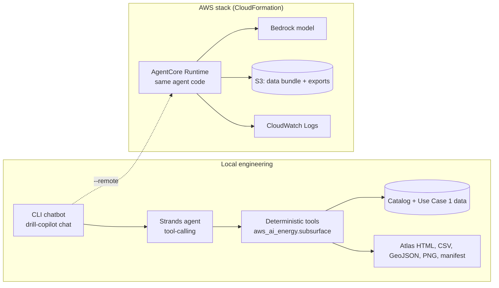

# Drilling Hazard Copilot

> Proposal skeleton for the Claude Code + Bedrock AgentCore Energy hackathon, Use Case 1 (Drilling
> Report Analysis Agent). Sections marked **TODO** need a team decision at kickoff.

| Field | Value |
|---|---|
| Status | Proposed, 2026-09-16 |
| Use case | Use Case 1: Drilling Report Analysis Agent (Upstream) |
| Primary user | Drilling engineer planning the next well or section |
| Interfaces | CLI chatbot (local, offline-capable) and the same agent on Bedrock AgentCore Runtime |
| Delivery | CloudFormation stack in `infra/cloudformation/template.yaml` |
| Team and owners | **TODO** |

## 1. One-line pitch

Before a well is drilled, show the engineer where faults and fracture corridors sit, what went wrong
the last time wells drilled into those hazards, and which file, row, or passage backs every claim.

## 2. Problem and business impact

- NPT is 15–25% of well cost in complex programs; one stuck-pipe event averages $500K–$2M
  (Use Case 1 brief).
- The Use Case 1 incident log alone records 23 NPT incidents, 427.1 hours, and $13,681,500
  (`npt_incident_log.csv`); 13 of the 23 are in Wolfcamp A.
- Subsurface interpretation (faults, fractures, reservoir quality) and drilling history live in
  different systems. Engineers search both by hand, so lessons repeat across wells.

**Measurable target (TODO confirm):** a cited hazard brief for a planned location in under one
minute, with every number traceable to an input row or passage, versus hours of manual search.

## 3. Solution concept

Three linked capabilities, one agent:

1. **Subsurface screen.** Detect faults (fault likelihood plus coherence loss, Hough line search) and
   fracture corridors (P90 intensity grid) in the HPC seismic catalog, then screen each planned well
   with a 0–100 screening index and depth intervals.
2. **Precedent linking.** Map each seismic hazard to NPT categories through explicit, reviewable rules
   (`hazard_rules.json`), then cite matching Use Case 1 incidents, formation thresholds, and
   reference-document passages.
3. **Evidence lineage.** The catalog model (projects → sites → datasets → dimensions → segments →
   files → machine/filesystem/path) plus a SHA-256 export manifest lets the agent say exactly which
   sample, file, or row supports an answer.

Also available: per-sample `hazard_score`, `target_score`, and a `decision`
(`geomechanics_review`, `drilling_candidate`, `watch_zone`) to rank reservoir targets that are
attractive but lower risk.

## 4. Grounding contract

The judges score whether claims trace back to the data. The agent follows these rules:

| Evidence class | Source | How it is cited |
|---|---|---|
| `hackathon_use_case_1` | `Hackathon/use-case-1/data/*.csv`, `reference_docs/*.md` | `npt_incident_log.csv row 13 (incident_id=NPT-0013)`; `reference_docs/bop_procedures.md line 81 (3.1 Kick Detection — Warning Signs)` |
| `generated_seismic_catalog` | `generate.seismic_catalog` output (synthetic) | `visualization_points.csv rows 433, 1393, …`; catalog run id |
| `screening_rule` | `hazard_rules.json` | Rule name and rationale, labelled as an engineering assumption |
| `derived_screening_output` | Analyzer exports | Cite the inputs, never the output alone |

Known data traps, handled explicitly:

- Corpus A (JSON DDRs, `well_name`) and Corpus B (CSV DDRs, `well_id`) do not join.
- Only 4 of 23 NPT incidents have a Corpus A DDR on the incident day, so "12–24 h early warning"
  is not claimed across the portfolio.
- `anomaly_thresholds.csv` has no Spraberry rows; the agent says so instead of inventing an envelope.
- The seismic catalog is synthetic and does not share well identifiers with Use Case 1. The analog
  formation is an explicit user choice; samples are never joined to real wells by depth.
- Screening indices use fixed weights and are ranks, not calibrated probabilities.

## 5. Judged demo journey (acceptance test)

| Step | Detail |
|---|---|
| Sample input | Seeded catalog (`--seed 42`, 10 datasets), Use Case 1 data, analog formation Wolfcamp A |
| Action | Engineer asks: "Screen well_05 before we drill. What could go wrong and what did we do last time?" |
| Visible output | Ranked hazards with measured values, cited precedents and procedures, atlas map and section |
| Controlled failure | Ask for Spraberry thresholds: answer states the table has no rows and claims no envelope |
| Fallback | Pre-generated `hazard_atlas.html`, PNGs, and CLI transcript from the offline path |

Real output from the current analyzer (trimmed):

```text
$ python -m generate.analyze_catalog wells --output-dir <catalog> --well well_05
well_05: screening index 95 (severe); 9 m to F2; P90 fracture 0.852
  seismic evidence: visualization_points.csv rows 433, 1393, 1450, 2353, 4273, ...
  - Well path inside a fault damage zone: 9 m from F2 (damage half-width 68 m + 100 m)
  - Large-throw fault near the well: F2 throw 172 m at 9 m
    fault_damage_zone: 7 incident(s) in lost_circulation, well_control for formation 'Wolfcamp A'.
      NPT-0013 Reagan County C 3H: natural_fractures -> pumped_lco_pill, 29.8 h, $871,700
        [npt_incident_log.csv row 13 (incident_id=NPT-0013)]
      ref: - Pit gain (flow check required if >1 bbl unexplained gain)
        [reference_docs/bop_procedures.md line 81 (3.1 Kick Detection — Warning Signs)]

$ python -m generate.analyze_catalog wells --output-dir <catalog> --well well_01 --formation Spraberry
anomaly_thresholds.csv has no rows for 'Spraberry'; no operating envelope is claimed.
```

## 6. Architecture



| Component | Responsibility | Failure behavior |
|---|---|---|
| `aws_ai_energy.subsurface` tools | Faults, fractures, well screens, precedents, exports | Raise `SubsurfaceDataError` with the missing file or row; never guess |
| Agent (Strands) **TODO build** | Pick tools, compose cited answer, refuse unsupported claims | Model failure: return the deterministic tool output, labelled |
| CLI chatbot **TODO build** | REPL, `/export`, `/atlas`, offline or `--remote` mode | Offline mode needs no network or credentials |
| AgentCore Runtime | Hosts the same agent entry point | Health or invoke failure: show local fallback artifacts |
| S3 bucket | Data bundle (≈0.6 MB Use Case 1 + seeded catalog), code zip, exports | Missing object: tool error names the key |
| Bedrock model | Answer composition only; numbers come from tools | Access denied or throttled: labelled deterministic answer |

## 7. Agent design

One agent with tools. In three hours, one well-grounded agent beats a multi-agent pipeline.

| Tool | Backed by | Status |
|---|---|---|
| `screen_well(well_id or inline,crossline, formation)` | `analysis.analyze_survey` + `hazards.screen_well` | Built |
| `list_faults()` / `list_fracture_corridors()` | `faults.detect_faults`, `fractures.find_corridors` | Built |
| `top_reservoir_targets(n)` | `scoring.score_points`, `top_scores` | Built |
| `find_precedents(categories, formation)` | `drilling.find_precedents` | Built |
| `get_thresholds(formation)` | `drilling.thresholds_for` | Built |
| `cite_reference(document, phrase)` | `drilling.find_reference_passage` | Built |
| `export_bundle()` | `export.export_bundle` | Built |
| `find_supporting_files(datasetid, segmentid, fileid)` | Catalog `files` table | **TODO** |

System prompt rules: every number comes from a tool result; every claim carries the tool's citation;
when a tool reports missing data, say so; label synthetic seismic evidence as synthetic.

## 8. CLI chatbot utility

Available now (`seismic-catalog-analyze`, or `python -m generate.analyze_catalog`):

```bash
python -m generate.analyze_catalog demo --output-dir outputs/hazard_demo   # generate + analyze + export
python -m generate.analyze_catalog faults     --output-dir <catalog>
python -m generate.analyze_catalog fractures  --output-dir <catalog>
python -m generate.analyze_catalog wells      --output-dir <catalog> --well well_05
python -m generate.analyze_catalog wells      --output-dir <catalog> --at 2250,1100
python -m generate.analyze_catalog targets    --output-dir <catalog> --top-n 10
python -m generate.analyze_catalog            --output-dir <catalog>   # export (default)
```

To build (**TODO**): `drill-copilot chat`

- Offline mode (default): intent routing to the tools above; deterministic, testable, no billing.
- Model mode (`--model`): Bedrock-backed agent; billable, so it needs explicit operator opt-in.
- Remote mode (`--remote`): invokes the deployed AgentCore Runtime endpoint read from stack outputs.
- Slash commands: `/wells`, `/well <id>`, `/faults`, `/targets`, `/export`, `/atlas`, `/sources`.

## 9. Visualization and exports (built)

The analyzer writes each run to `analysis/<run_id>/` without overwriting. Full file list:
`generate/readme.md`.

- `hazard_atlas.html`: self-contained; map (fracture heat, fault traces and damage zones, wells by
  screening class), well ranking, depth section with horizons, drilling brief with citations, and
  table views. Light and dark themes; validated palette; hover and keyboard tooltips.
- PNGs: hazard map, reservoir target map, drilling risk section, well ranking, fault attribute
  crossplot, 3D fracture volume with fault planes.
- Data: `enriched_points.csv`, hotspots, targets, faults (CSV/JSON/GeoJSON), fracture cells and
  corridors, well screens and briefs, hazard intervals, precedents, thresholds, rules, scorecard,
  `summary.json`, `manifest.json`.

## 10. AWS deployment (CloudFormation)

Stack boundary (**TODO** confirm region, stack name, model ID):

| Resource | Purpose |
|---|---|
| `AWS::S3::Bucket` (or existing artifact bucket) | Code zip, data bundle, exports |
| `AWS::IAM::Role` | AgentCore execution role: `bedrock:InvokeModel` on the chosen model, `s3:GetObject` on the bundle prefix, logs |
| `AWS::BedrockAgentCore::Runtime` | `CodeConfiguration` with S3 `Code`, `EntryPoint`, `Runtime: PYTHON_3_12` |
| `AWS::BedrockAgentCore::RuntimeEndpoint` | Named endpoint for smoke tests (optional) |
| `AWS::Logs::LogGroup` | Explicit retention |

Delivery steps follow `.agents/skills/aws-cloudformation-deployment/SKILL.md`: local gate,
`validate-template`, read-only preflight with operator approval, package, deploy with explicit
profile, region, parameters, and tags, read back outputs, then health and journey smoke checks.
Run `agentcore dev --port 3000` locally, because port 8080 is the lab editor.

Open cloud decisions (**TODO**):

- `versions.env` sets `BEDROCK_MODEL_ID=moonshotai.kimi-k2.5`; the event is Claude + AgentCore.
  Choose the Claude model or inference profile and confirm availability in the region.
- Region: repo default `us-east-2`; lab setup examples use `us-east-1`.
- Whether `agentcore` CLI deploy is used for iteration and CloudFormation for the judged stack.

## 11. 180-minute plan

| Time | Outcome | Owner (**TODO**) |
|---|---|---|
| 0–15 | Lock this proposal, model ID, region, stack name; run `make hazard-demo` | Integration owner |
| 15–45 | Agent entry point wrapping the built tools; offline CLI chat skeleton | Agent A (`src/aws_ai_energy/agent/`) |
| 15–45 | CloudFormation template skeleton and packaging script | Agent B (`infra/cloudformation/`) |
| 45–105 | Chat journey end to end, controlled failure, focused tests; local-slice review and sign-off | Agent A + integration |
| 105–135 | Deploy, read outputs, deployed health and journey smoke; cloud review and sign-off | Agent B |
| 135–155 | Security, deployment, and demo blockers only | All |
| 155–175 | Evidence capture, architecture visual, timed pitch; presentation review and sign-off | Presenter |
| 175–180 | Reset sample state, open fallback artifacts, go/no-go | Integration owner |

Milestone reviews: `make solution-review MILESTONE=<local-slice|cloud-delivery|presentation>`, then
`make review-signoff` and `make review-gate`. Do not run Claude Code, Codex, and Hermes as concurrent
writers to the same working tree.

## 12. Scope

**Must:** cited well brief through the CLI; controlled failure; atlas and PNG fallback; CloudFormation
deploy of the same agent; deployed smoke evidence; focused offline tests.

**Should:** `--remote` CLI mode; `find_supporting_files` lineage tool; Corpus A DDR narrative search
for the four incidents that have same-day reports.

**Cut:** multi-agent orchestration, vector search, PDF parsing, web UI beyond the static atlas,
AgentCore Memory and Gateway, multi-user auth.

## 13. Risks and fallbacks

| Risk | Fallback |
|---|---|
| Model access or region mismatch | Offline deterministic answers from the same tools, labelled |
| AgentCore deploy fails late | Show validated template, stack events, local agent run, and atlas |
| Judges question synthetic seismic data | Evidence classes, scorecard vs catalog truth, explicit analog-formation choice |
| Screening index read as a prediction | Label as fixed-weight rank; show the measured values behind it |
| Demo machine or network issue | Pre-rendered atlas, PNGs, and recorded CLI transcript |

## 14. Pitch outline (3–5 minutes)

1. Problem: NPT cost and repeated incidents (30 s).
2. Live journey: screen well_05, cited hazards and precedents (90 s).
3. Controlled failure: Spraberry thresholds absent, no invented envelope (20 s).
4. Atlas: map, section, detection scorecard (40 s).
5. Architecture and AWS proof: stack outputs and deployed smoke (40 s).
6. Limitations and next steps (20 s).

Likely judge questions: How do you know the fault detection works? (Scorecard vs catalog truth.)
Why link seismic hazards to these incidents? (Explicit rules file; rationale per rule.) What happens
when data is missing? (Tools say so; demo shows it.) What is deployed? (Stack outputs and smoke logs.)

## 15. Evidence log

| Check | Command | Result |
|---|---|---|
| Local tests | `make test` | **TODO** record at the local-slice milestone |
| Lint and types | `make lint`; `.venv/bin/python -m mypy src/aws_ai_energy/subsurface` | **TODO** |
| Offline demo | `make hazard-demo` | **TODO** |
| Template validation | `aws cloudformation validate-template ...` | Not run |
| Deployed smoke | Health and journey requests from stack outputs | Not run |
